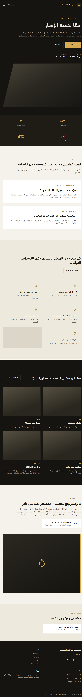
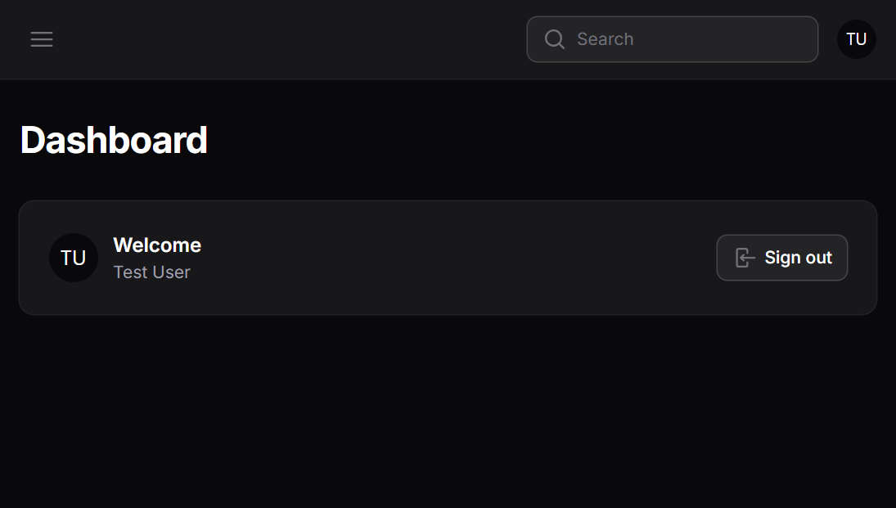

# Mansour

A bilingual (Arabic/English) corporate website built with Laravel, featuring a full self-service admin panel so the client can manage all site content without touching code.

## Overview

Mansour is a corporate marketing website with complete RTL (Arabic) and LTR (English) support. Every page and content block is fully translatable, and the client has a custom admin dashboard to update text, images, and media — no developer involvement needed for day-to-day content changes.

## Features

- 🌐 Full bilingual support (Arabic/English) with automatic RTL/LTR switching
- 🎛️ Custom admin panel for self-managing all site content
- 🖼️ Media library integration for image and file management
- ⚡ Fast, modern frontend built with Vite and Tailwind CSS
- ✅ Test coverage with Pest

## Screenshots

### Frontend homepage

### Admin dashboard

## Tech Stack

- **Backend:** Laravel 13, PHP 8.3
- **Admin Panel:** Filament 5
- **Database:** MySQL
- **Frontend:** Blade, Tailwind CSS, Vite
- **Packages:** Spatie Media Library, Spatie Translatable
- **Testing:** Pest
- **Code Style:** Laravel Pint

## Getting Started

### Prerequisites

- PHP ^8.3
- Composer
- Node.js & npm
- MySQL

### Installation

\`\`\`bash
git clone https://github.com/Mohamad-Kahwaji/Mansour.git
cd Mansour
composer install
cp .env.example .env
php artisan key:generate

# configure your database credentials in .env

php artisan migrate
npm install
npm run build
\`\`\`

### Development

\`\`\`bash
composer dev
\`\`\`

This runs the Laravel server, queue listener, and Vite dev server concurrently.

### Testing

\`\`\`bash
composer test
\`\`\`

## License

This project is proprietary and was developed as a client project. The code is shared here for portfolio purposes.

## Author

**Mohamad Kahwaji**
Laravel Backend Developer
[GitHub](https://github.com/Mohamad-Kahwaji)
